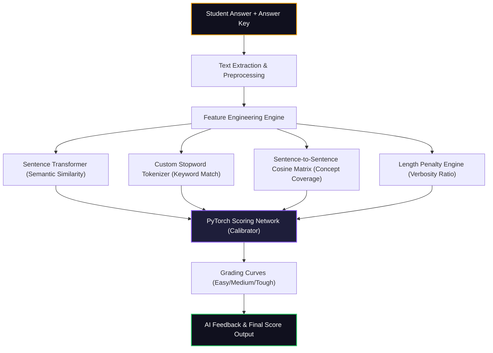

# AI EvalPro - Automated NLP Answer Grading System 🧠🎓

This document is your complete **LinkedIn and Portfolio Showcase Hub** for **AI EvalPro**! It is custom-tailored to incorporate the actual screenshots of your running application.

## 📂 Setting Up Your Showcase Screenshots
To make this document look stunning in your local markdown viewer (like VS Code or Obsidian) or on GitHub, create a folder named `screenshots` in your project root and save your 5 screenshots there with the following filenames:

1. **`1_configure.png`**: The "Configure Evaluation" screen.
2. **`2_evaluation_mode.png`**: The "Evaluation Mode" select cards.
3. **`3_manual_input.png`**: The "Manual Input" text areas.
4. **`4_file_upload.png`**: The "File Upload" drag-and-drop workspace.
5. **`5_results_dashboard.png`**: The final "AI Results Dashboard".

---

# 🚀 LinkedIn Feed Post (Copy & Paste)

*Attach your **Results Dashboard (`5_results_dashboard.png`)** and **Evaluation Mode (`2_evaluation_mode.png`)** screenshots to this post to get maximum visibility!*

---

🚀 **Excited to share my latest project: AI EvalPro — an NLP-powered Answer Evaluation & Automated Grading System!** 🧠🤖

Evaluating subjective, descriptive student answers is one of the most time-consuming parts of education. Simple keyword-matching systems are easily tricked and fail to recognize synonyms, while large models can be slow and expensive. 

To solve this, I built **AI EvalPro** — a hybrid automated evaluation engine that integrates **Sentence-level BERT Transformers** and a custom **PyTorch neural network** to grade answers with human-like precision!

### 💡 The Tech Stack:
* 🖥️ **Frontend**: React + Vite + Tailwind CSS + Framer Motion (for a highly polished glassmorphism dark-mode interface)
* ⚡ **Backend**: FastAPI (Python) for ultra-fast asynchronous inference
* 🧠 **NLP Engine**: Hugging Face's **Sentence Transformers (all-MiniLM-L6-v2)** to compute semantic similarity
* 🎛️ **AI Scoring**: A custom **PyTorch Feedforward Neural Network** that fuses semantic, keyword, conceptual, and length features into a calibrated 0-100% grade

### 🌟 Core Features in Action:
1️⃣ **Multi-Dimensional AI Evaluation**: Grades answers based on **Semantic Similarity** (embedding distance), **Terminology Overlap** (stopword-filtered keywords), **Concept Coverage** (sentence alignment mapping), and **Length Optimization** (penalizes padding).
2️⃣ **Interactive Configuration**: Customize the question count, assign variable marking weights, and select grading rigor modes (*Easy, Medium, Tough, Lenient*).
3️⃣ **Flexible Entry Modes**: Support for direct manual typing or dragging & dropping answer sheets and keys (PDF, TXT, Image).
4️⃣ **Explainable AI Dashboards**: Highlights grades with comprehensive component bar charts and generates diagnostic written critiques.

Building this system gave me incredible experience in combining classical NLP heuristics, modern vector embeddings, and PyTorch regression layers into an end-to-end, high-performance web application.

I’d love to hear your thoughts on AI-driven grading systems in the comments! 👇

*Check out the screenshots of my working local application below!*

#MachineLearning #NLP #PyTorch #ReactJS #FastAPI #EdTech #ArtificialIntelligence #DeepLearning #WebDevelopment #HuggingFace

---

# 📝 Comprehensive Case Study (For LinkedIn Articles or GitHub)

---

# Case Study: AI EvalPro — Intelligent Automated Answer Evaluation

## 🔍 The Problem
Grading subjective short-answer questions programmatically is a classic NLP challenge. 
* Standard string similarity algorithms (e.g., Levenshtein distance) fail when students use synonyms.
* Keyword matchers can be easily bypassed by writing long, off-topic paragraphs filled with terminology.
* Manual grading creates a massive bottleneck for educators handling large classrooms.

**AI EvalPro** addresses these challenges by breaking subjective grading into distinct numerical features and aligning them using a calibrated neural network.

---

## 📸 Guided Application Walkthrough

### 1. Parametric Evaluation Setup
We begin by configuring our workspace parameters. The system allows educators to set the exact number of questions and specify the marks distribution.


*Figure 1: The Configure Evaluation screen, featuring customized numeric controls and dynamic marking options.*

---

### 2. Algorithmic Rigor Configuration
Educators can select the evaluation rigor. The system provides four predefined scoring weights and cosine similarity thresholds: **Easy**, **Medium**, **Tough**, and **Lenient**.


*Figure 2: Custom grading curve adjustment cards with distinct glowing HSL indicators.*

---

### 3. Dual Sandbox Input Interfaces
Depending on the grading volume, the application adapts to two distinct inputs:

#### Option A: Manual Entry Playground
For immediate testing or grading a single exam sheet, users can type or paste the Answer Key and Student Answer side-by-side.


*Figure 3: Interactive manual testing sandbox with expandable question containers.*

#### Option B: Bulk Document Upload
For large-scale processing, the application features drop zones for PDF, TXT, Image, or Word files, utilizing backend parsers to extract and segment questions.


*Figure 4: Asynchronous drag-and-drop document upload interface.*

---

### 4. The AI Results & Analytics Dashboard
Once processed, the backend returns a comprehensive dashboard showing the final grade, total marks, overall accuracy, and a detailed breakdown per question.


*Figure 5: High-fidelity analytics dashboard detailing semantic similarity, keyword match, and concept coverage scores alongside automated text feedback.*

---

## 🛠️ Deep Technical Deep Dive



### 🧠 The Core Scoring Logic
The core power of **AI EvalPro** lies in its feature-fusion architecture:

1. **Semantic Similarity ($S_s$)**: Uses a local **all-MiniLM-L6-v2** Sentence Transformer to convert text blocks into dense 384-dimensional vector embeddings, calculating the cosine similarity of the overall meaning:
   $$\text{Semantic Score} = \cos(\vec{u}, \vec{v}) = \frac{\vec{u} \cdot \vec{v}}{\|\vec{u}\| \|\vec{v}\|}$$
2. **Keyword Match ($K_m$)**: Tokenizes text, filters out a specialized list of grammatical stopwords, and calculates the vocabulary overlap:
   $$\text{Keyword Score} = \frac{|Keywords_{Key} \cap Keywords_{Student}|}{|Keywords_{Key}|}$$
3. **Concept Coverage ($C_c$)**: Splices the expected answer key into individual sentences (concepts) and measures how many of those individual concepts are covered anywhere in the student's answer using a similarity matrix.
4. **Length Ratio ($L_r$)**: Evaluates word counts to penalize overly brief answers or extremely padded paragraphs.

### 🔌 Custom PyTorch Calibrator
Rather than using arbitrary weights, these four features are passed through a custom-trained **PyTorch Feedforward Regression Network**:
```python
class ScoringNetwork(nn.Module):
    def __init__(self):
        super().__init__()
        self.network = nn.Sequential(
            nn.Linear(4, 32),
            nn.ReLU(),
            nn.Dropout(0.1),
            nn.Linear(32, 16),
            nn.ReLU(),
            nn.Linear(16, 8),
            nn.ReLU(),
            nn.Linear(8, 1),
            nn.Sigmoid()
        )
    def forward(self, x):
        return self.network(x) * 100
```
This network integrates the metrics and calibrates the final grade to match realistic human grading profiles.

---

## 📈 Key Achievements & Core Learnings
* **Local Transformer Inference**: Leveraging a lightweight transformer model enables extremely fast local calculations, entirely avoiding slow and costly third-party LLM APIs.
* **Calibrated Neural Layers**: Training a regression network on custom-designed scoring rules provides highly consistent, explainable grades.
* **Premium UX Aesthetics**: Building responsive glassmorphic interfaces with Tailwind CSS and Framer Motion makes complex data feel highly accessible and visually premium.

---
*Developed by MUNNA — 2026*
