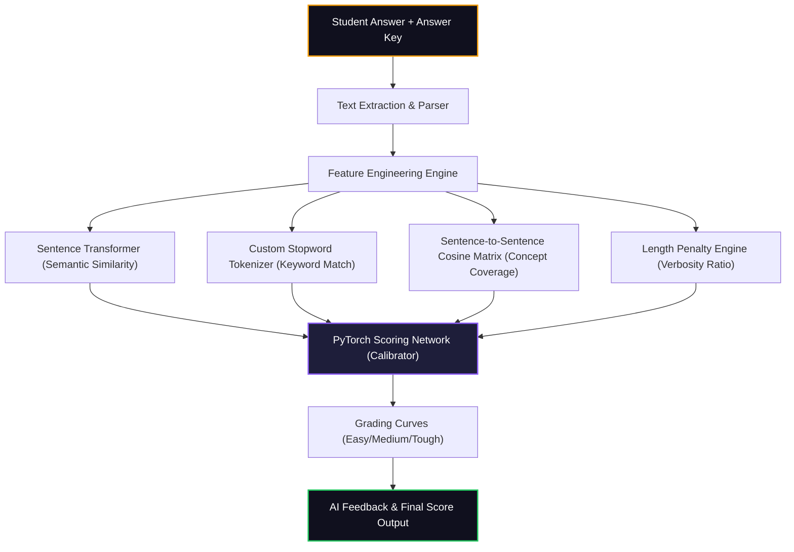

# AI EvalPro - Automated NLP Answer Grading System 🧠🎓

AI EvalPro is an intelligent, NLP-powered answer evaluation and automated grading system designed to evaluate subjective, descriptive student answers with human-like precision. It bypasses simple keyword matching and expensive LLM APIs by combining local **Sentence-BERT Transformers**, **Natural Language Processing features**, and a custom **PyTorch neural network** to compute highly calibrated scores.

---

## 🛠️ Tech Stack

- **Frontend**: React + Vite + Tailwind CSS + Framer Motion (glassmorphic dark-mode UI with smooth micro-animations)
- **Backend**: FastAPI (Python) for fast asynchronous processing and inference
- **NLP Engine**: Hugging Face's **Sentence Transformers (all-MiniLM-L6-v2)** to compute semantic similarity
- **Scoring Layer**: A custom **PyTorch Feedforward Neural Network** regression layer to fuse features and calibrate grades

---

## 🚀 Key Features

1. **Multi-Dimensional AI Evaluation**: Calculates grades using four independent NLP dimensions:
   - **Semantic Similarity**: Measures overall conceptual meaning using dense 384-dimensional sentence embedding vectors.
   - **Terminology Overlap**: Compares vocabulary usage and technical terms (using a stopword-filtered set).
   - **Concept Coverage**: Segments the answer key into individual sentences and maps them against the student's answer using a cosine similarity matrix to ensure every critical concept is covered.
   - **Length Calibration**: Analyzes word counts to penalize answers that are too brief or padded with excessive fluff.
2. **Interactive Configuration**: Customize question counts, set custom marks per question, and adjust grading rigor.
3. **Rigorous Grading Modes**: Select from four preset evaluation curves:
   - **Easy**: Lenient scoring threshold, bonus points, and high partial credit.
   - **Medium**: Standard, balanced calibration curve.
   - **Tough**: Strict similarity threshold and penalty offsets for incomplete answers.
   - **Lenient**: Designed to maximize partial credit and ignore small omissions.
4. **Bulk Document Upload & OCR**: Supports direct copy-pasting of answers or dragging & dropping files (PDF, TXT, DOCX, and Images via OCR).
5. **Explainable Diagnostics**: Displays a high-fidelity results dashboard complete with scoring breakdown charts and automated feedback critiques.

---

## 📐 System Architecture



---

## 📦 Installation & Setup

### Prerequisites

- **Python**: 3.8 or higher
- **Node.js**: 16.x or higher
- **Tesseract OCR** *(Optional, required only for extracting text from images)*: [Install Tesseract](https://github.com/UB-Mannheim/tesseract/wiki) and ensure it is added to your system PATH.

### 1. Clone the Repository

```bash
git clone https://github.com/Harsha-Movva/ai-model-evaluation.git
cd ai-model-evaluation
```

### 2. Backend Setup

1. Navigate to the backend directory:
   ```bash
   cd backend
   ```
2. Install the required packages:
   ```bash
   pip install -r requirements.txt
   ```
3. Run the FastAPI development server:
   ```bash
   python main.py
   ```
   The backend API will be available at `http://localhost:8000`.

### 3. Frontend Setup

1. Open a new terminal and navigate to the frontend directory:
   ```bash
   cd ../frontend
   ```
2. Install dependencies:
   ```bash
   npm install
   ```
3. Start the Vite dev server:
   ```bash
   npm run dev
   ```
   The web interface will be available at `http://localhost:3000` (or the port indicated in your console).

### 4. Running with the Shortcut (Windows)

On Windows systems, you can start both the backend and frontend servers simultaneously by double-clicking the `start.bat` script located in the project root directory.

---

## 🧠 Core Scoring Logic & Formulae

1. **Semantic Similarity ($S_s$)**: Cosine similarity between the vector embeddings of the answer key ($u$) and student answer ($v$):
   $$\text{Semantic Score} = \cos(\vec{u}, \vec{v}) = \frac{\vec{u} \cdot \vec{v}}{\|\vec{u}\| \|\vec{v}\|}$$
2. **Keyword Match ($K_m$)**: The vocabulary overlap after removing standard grammatical stopwords:
   $$\text{Keyword Score} = \frac{|Keywords_{Key} \cap Keywords_{Student}|}{|Keywords_{Key}|}$$
3. **Concept Coverage ($C_c$)**: Splices the expected answer key into individual sentences (concepts) and measures how many of those individual concepts are covered anywhere in the student's answer using a similarity matrix.
4. **Length Ratio ($L_r$)**: Evaluates word counts to penalize overly brief answers or extremely padded paragraphs.

### Calibrated Regression Network

These four features are combined and passed through a PyTorch Feedforward Regression Neural Network. The network outputs a calibrated score between $0.0$ and $100.0$:

```python
class ScoringNetwork(nn.Module):
    def __init__(self):
        super().__init__()
        self.network = nn.Sequential(
            nn.Linear(4, 32),
            nn.ReLU(),
            nn.Dropout(0.1),
            nn.Linear(32, 16),
            nn.ReLU(),
            nn.Linear(16, 8),
            nn.ReLU(),
            nn.Linear(8, 1),
            nn.Sigmoid()
        )
    def forward(self, x):
        return self.network(x) * 100
```

---

## 📂 Project Structure

```
ai-model-evaluation/
├── backend/
│   ├── evaluator.py          # NLP evaluation engine & scoring network
│   ├── text_extractor.py     # Multi-format document parser (PDF, Docx, Image, Text)
│   ├── main.py               # FastAPI server router & endpoints
│   └── requirements.txt      # Python backend dependencies
├── frontend/
│   ├── src/
│   │   ├── components/       # Config, Input, Processing, and Results steps
│   │   ├── App.jsx           # Main React component & step controller
│   │   ├── api.js            # Axios endpoint integrations
│   │   ├── index.css         # Styling directives and custom scrollbars
│   │   └── main.jsx          # React entry point
│   ├── package.json          # Node dependencies and scripts
│   ├── tailwind.config.js    # Tailwind layout and themes
│   └── vite.config.js        # Vite configuration
├── start.bat                 # Fast startup batch script for local hosting
└── README.md                 # Project documentation
```

---

*Developed by Harsha-Movva & MUNNA — 2026*
